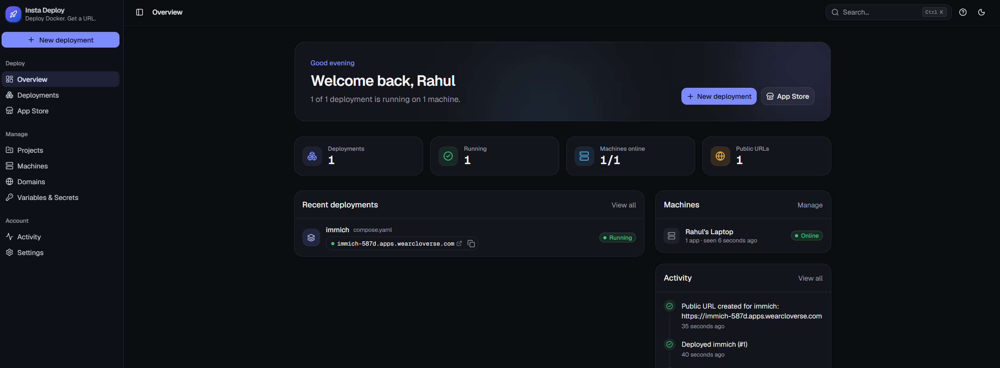
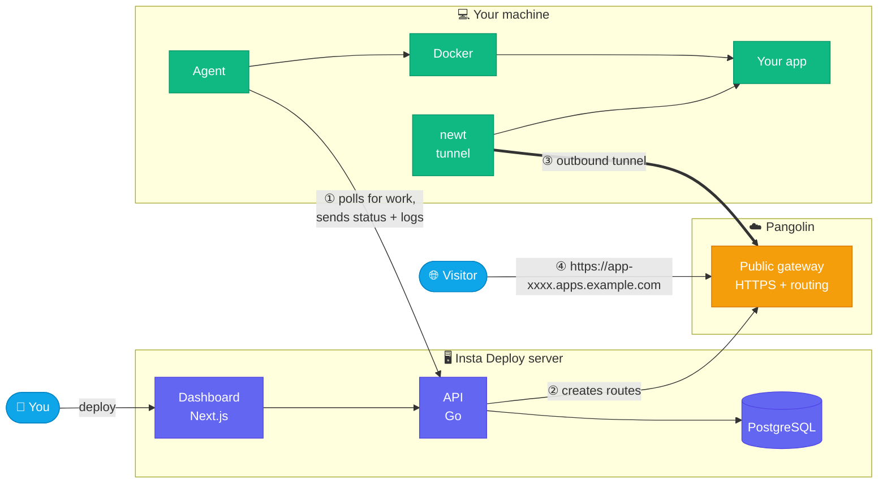

<div align="center">

# 🚀 Insta Deploy

### Deploy Docker. Get a URL.

**Run any Docker app on your own machine and get a public HTTPS URL in seconds.**<br/>
No port forwarding. No reverse proxy. No certificates. No cloud bill.

<br/>


[**Quick start**](#-quick-start) · [**Features**](#-features) · [**How it works**](#%EF%B8%8F-how-it-works) · [**Docs**](#-documentation)

<br/>



</div>

---

## ✨ Why Insta Deploy?

You have a laptop, a home server or a cheap VPS. You want to run **Immich**, **Jellyfin**, **Paperless-ngx** or your own app, and share it with a real URL.

Usually that means port forwarding, a reverse proxy, DNS records and TLS certificates. **Insta Deploy does all of it for you.** Pick an app, click **Deploy**, and get a URL like:

```
https://immich-587d.apps.example.com
```

Your machine never opens a port: traffic arrives through an outbound tunnel powered by [Pangolin](https://github.com/fosrl/pangolin).

## 🎯 Features

<table>
<tr>
<td width="50%" valign="top">

### 📦 Deploy anything
- **App Store**: 36 one-click apps (Immich, Jellyfin, Nextcloud, Vaultwarden, n8n…)
- **Docker images** from any registry, including private ones
- **Dockerfiles** from a ZIP upload or a Git repo
- **Docker Compose** multi-service projects
- **Paste a `docker run` command** straight from a README

</td>
<td width="50%" valign="top">

### 🌍 Public URLs, zero config
- Automatic **HTTPS URL** for every public service
- **Custom domains** with guided DNS setup
- Choose which services are **public or private**
- **No open ports**: everything flows through an outbound tunnel
- Works behind NAT, CGNAT and firewalls

</td>
</tr>
<tr>
<td width="50%" valign="top">

### 🔍 Operate with confidence
- **Live build and deployment logs**, plus container logs
- **One-click rollback** to any earlier version
- **Health checks** and CPU, memory and network usage
- **Git auto deploy** on new commits
- **⌘K command palette** to jump anywhere

</td>
<td width="50%" valign="top">

### 🔐 Secure by default
- **Secrets encrypted** (AES-256-GCM) and redacted from logs
- Dangerous Compose settings (privileged, host network…) **refused**
- **Projects and environments** (production, staging, development)
- **Multiple machines**, each with its own revocable token
- Light and dark mode

</td>
</tr>
</table>

## ⚡ Quick start

> **Requires:** Docker with Compose v2.24+

```bash
git clone <repo-url> insta-deploy && cd insta-deploy
docker compose up -d --build
```

Open **http://localhost:3000**, create your account, and the setup guide takes you from zero to a live URL:

| Step | What happens |
| :---: | --- |
| **1** 🖥️ | **Server address**: tell machines where to find Insta Deploy |
| **2** 🌍 | **Public URLs**: connect your Pangolin organization and domain ([guide](docs/pangolin.md)) |
| **3** 🔌 | **Connect a machine**: run one `docker run` command on it |
| **4** 🚀 | **Deploy**: a test app, or anything from the App Store |

> 💡 No `.env` file needed. Every setting lives in the dashboard.

## 🏗️ How it works



1. **You deploy** from the dashboard. The **agent** on your machine picks up the job over an outbound connection, then pulls or builds the images and starts the containers.
2. **The API asks Pangolin** to create a public route for every public service.
3. **newt**, the tunnel client, connects *out* to Pangolin. Your machine never accepts incoming connections.
4. **Visitors** hit Pangolin over HTTPS and are forwarded through the tunnel to your app.

## 🧰 Tech stack

| Layer | Technology |
| --- | --- |
| 🎨 Dashboard | Next.js · TypeScript · Tailwind CSS · shadcn/ui · Better Auth |
| ⚙️ API | Go · chi · PostgreSQL |
| 🤖 Agent | Go · Docker Engine API · Docker Compose · BuildKit |
| 🌐 Networking | Pangolin (Cloud or self-hosted) · newt tunnels · Let's Encrypt |

## ⚙️ Configuration (optional)

For production, add a `.env` next to `docker-compose.yml` ([example](.env.example)):

| Variable | Use |
| --- | --- |
| `BETTER_AUTH_URL` | Dashboard served over HTTPS, e.g. `https://deploy.example.com` |
| `BETTER_AUTH_SECRET`, `SECRETS_KEY` | Supply your own secrets instead of generated ones |
| `MAX_UPLOAD_MB`, `GIT_POLL_SECONDS` | Upload size limit and Git polling interval |

## 🛡️ Security

> ⚠️ **The agent controls Docker on its machine.** Only connect machines you trust this server with.

- Agents connect **out only**, and published host ports are stripped; public access goes only through Pangolin.
- Secrets are **encrypted at rest**, never returned by the API, and **redacted** from every log.
- Compose files are validated: privileged mode, host networking, devices and the Docker socket are rejected.

## 📚 Documentation

| Guide | What's inside |
| --- | --- |
| 🏗️ [Architecture](docs/architecture.md) | Components, data model, task queue, routing, logs |
| 📦 [Deployments](docs/deployments.md) | Every deployment type, variables, volumes, rollbacks, domains |
| 🌍 [Pangolin setup](docs/pangolin.md) | Pangolin Cloud or self-hosted, API keys, custom domains |
| 🛠️ [Development](docs/development.md) | Run locally, code map, checks |
| ⬆️ [Upgrading](docs/upgrading.md) | Backups, upgrades and restores |

## 📁 Project structure

```
frontend/   🎨 Next.js dashboard
backend/    ⚙️ Go API, Pangolin integration, SQL migrations
agent/      🤖 Go agent: Docker, builds, Compose, logs, health
deploy/     🐳 docker-compose.yml for the server
docs/       📚 Guides
```

---

<div align="center">

**Your hardware. Your apps. Real URLs.**

⭐ **If Insta Deploy saves you time, give it a star!**

</div>
