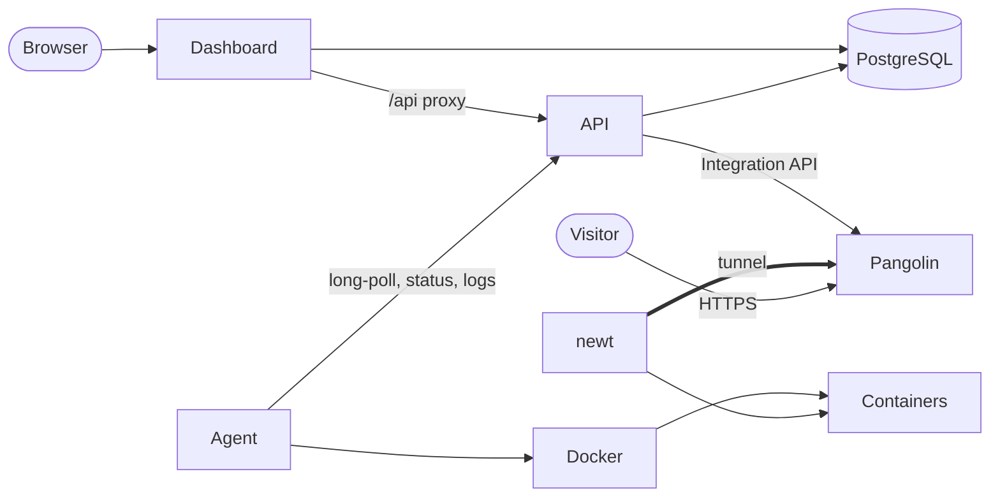
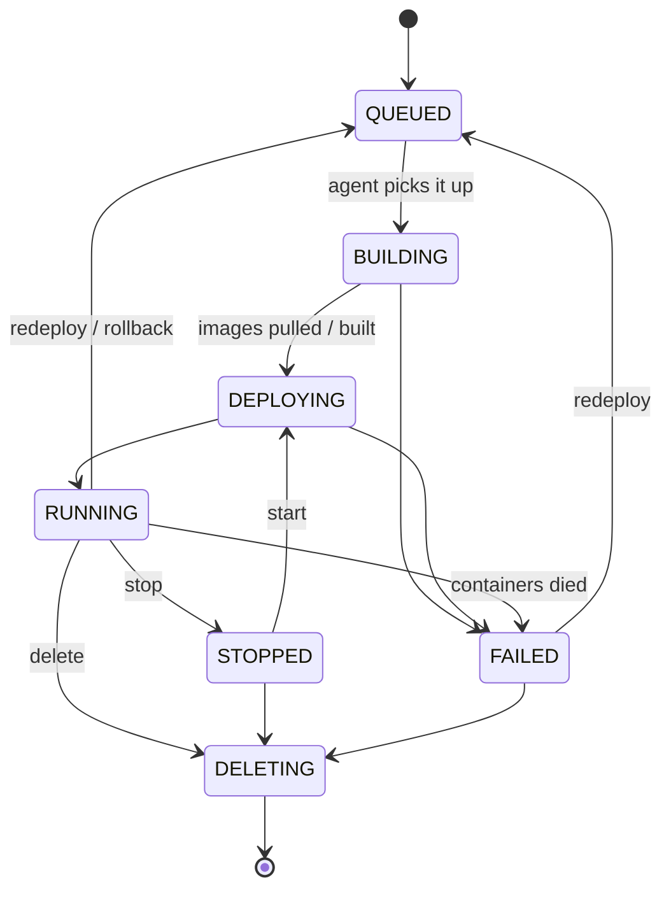

# Architecture

How Insta Deploy is put together, and how a deployment travels from the dashboard to a running container with a public URL.

## Components

| Component | Tech | Runs on | Responsibility |
| --- | --- | --- | --- |
| Dashboard | Next.js, shadcn/ui, Better Auth | Server | UI, accounts and sessions; proxies `/api/*` to the API |
| API | Go (chi) | Server | Projects, deployments, variables, history, task queue; configures Pangolin |
| PostgreSQL | | Server | All state |
| Agent | Go | Each machine | Runs work through Docker; the only component that touches Docker |
| newt | Pangolin's tunnel client | Each machine | Outbound tunnel that carries public traffic to containers |
| Pangolin | Cloud or self-hosted | Internet | Public hostnames, TLS certificates, routing into tunnels |

Two rules shape the design:

1. **The server never touches Docker.** It records what should happen, and agents do it.
2. **Machines only make outbound connections.** A laptop behind NAT works the same as a VPS. Nothing on the machine listens for incoming traffic.



## Authentication

- **Users**: Better Auth runs inside the dashboard (`/api/auth/*`). It owns the `user`, `session`, `account` and `verification` tables and handles sign-up, sign-in, rate limiting, password changes and session revocation. The first account is the admin, and only the admin can change server settings.
- **API**: the Go API has no login of its own. It takes the session token from the Better Auth cookie (or `Authorization: Bearer <token>`) and looks it up in the `session` table. Cross-site requests that carry a cookie are rejected.
- **Agents**: each machine has its own token (`idt_…`), stored as a SHA-256 hash. Tokens can be revoked or reissued at any time.

```
browser ──cookie──▶ Dashboard /api/[...path] ──▶ API ──▶ session table
script  ──Bearer session token──────────────────▶ API ──▶ session table
agent   ──Bearer idt_…──────────────────────────▶ API ──▶ agents.token_hash
```

## Data model

```
user ─┬─ project ─┬─ deployment ─┬─ deployment_revision  history and rollback
      │           │              ├─ service ── route     public URLs
      │           │              ├─ variable             deployment / service level
      │           │              └─ deployment_logs
      │           ├─ variable                            project / environment level
      │           └─ domain ── route                     custom domains
      ├─ agent ── agent_tasks
      └─ registry_credentials, github_apps, events
settings                                                 server-wide (Pangolin, addresses)
```

- **Deployment**: has a type (`IMAGE`, `DOCKERFILE` or `COMPOSE`) and a **spec**. Every type is normalized into the spec ([backend/spec.go](../backend/spec.go)), which never contains secret values.
- **Revision**: each deploy creates a numbered revision that stores a snapshot of the spec plus what actually ran (the image digest and the Git commit).
- **Service**: one container. Image and Dockerfile deployments have one; Compose deployments have one per Compose service.
- **Route**: one public hostname pointing at a service.

```json
{
  "type": "COMPOSE",
  "source": { "kind": "inline", "compose": "services: ..." },
  "services": [
    { "name": "web", "port": 80, "public": true },
    { "name": "postgres", "public": false }
  ]
}
```

## Deployment lifecycle



If you stop a deployment before the agent has picked it up, the deploy is cancelled. A deployment on an offline machine stays `QUEUED` until the machine reconnects.

## Agent tasks

Everything the server wants a machine to do is a row in `agent_tasks`: `DEPLOY`, `STOP`, `START`, `RESTART`, `DELETE`, `LOGS` or `ANALYZE`.

1. The agent long-polls `GET /api/agent/commands?wait=25`. The API answers as soon as work exists.
2. When a task is handed out, the API builds its full payload: resolved variables, decrypted secrets and registry credentials. Secrets travel over HTTPS and are **never stored in the task row**.
3. A deployment's tasks run strictly in order, so a stop waits for a running deploy to finish. `LOGS` and `ANALYZE` run independently and are request/response: the API waits up to 20 or 90 seconds for the result.
4. The agent reports progress (`BUILDING`, `DEPLOYING`), then either `DONE` with a result or `FAILED` with a message for the user.
5. When an agent restarts, its unfinished tasks are handed out again. Deploys are safe to repeat.

## What the agent does for each type

| Type | Steps |
| --- | --- |
| Image | Pull (records the digest) → replace the container under the same name → wait for it to run |
| Dockerfile | Fetch the source (Git clone) → `docker build` with BuildKit, tagged `insta-deploy/<id>:r<revision>` → run. The last 5 builds are kept for fast rollbacks. |
| Compose | Fetch the project → precheck → normalize → validate → transform → `docker compose pull`, `build`, `up -d --remove-orphans` |

Compose details:

1. Project files are written to `/var/lib/insta-deploy/projects/<deployment>`. Files the containers wrote there are kept.
2. **Precheck**: every `env_file`, `label_file`, `include` and `extends` file must be inside the project.
3. **Normalize**: `docker compose config` resolves `${VAR}` using your Insta Deploy variables only, never the agent's own environment.
4. **Validate**: privileged containers, host network/PID/IPC/UTS, `cap_add`, devices, `security_opt` (other than `no-new-privileges`), the Docker socket, and host paths outside the project or allow-list are all refused.
5. **Transform**: published `ports` are removed, labels are added, Insta Deploy variables are injected, and only public services join the `insta-deploy` network.

The agent runs `docker` and `git` with fixed argument lists and a clean environment. It never builds shell strings.

## Public URLs

The **route reconciler** ([backend/routes.go](../backend/routes.go)) runs every 20 seconds and right after any relevant change. It brings Pangolin in line with the database:

- every running public service with a port gets a `GENERATED` route, `<name>-xxxx.<apps domain>`, which stays stable for the life of the service;
- every verified custom domain gets a `CUSTOM` route to its service;
- routes for services that became private, or domains that moved, are removed;
- routes whose port or machine changed are updated.

Custom domains are checked for verification every 30 seconds. All Pangolin-specific code lives in `PangolinService` ([backend/pangolin.go](../backend/pangolin.go)), behind generic operations (sites, routes, domains), so another tunnel provider could replace it.

### How a request reaches a container

Each machine is a Pangolin **site**. The agent runs `newt` on a Docker network called `insta-deploy`, and public services join that network under a stable alias:

- image and Dockerfile deployments: `insta-<name>-<id8>`
- Compose services: `insta-<name>-<id8>-<service>`

The Pangolin route targets that alias and port. No ports are opened on the machine.

```
https://web-1a2b.apps.example.com
  → Pangolin (TLS) → tunnel → newt → insta-shop-12ab34cd-web:80 → container
```

### Where traffic is encrypted

| Hop | Protocol | Encrypted |
| --- | --- | --- |
| Visitor → Pangolin | HTTPS (Let's Encrypt certificate held by Pangolin) | Yes. **TLS terminates at Pangolin.** |
| Pangolin → newt on your machine | WireGuard tunnel | Yes |
| newt → container | Plain HTTP on the private `insta-deploy` Docker network | No, but it never leaves the machine |

Because TLS ends at Pangolin, Pangolin can see the decrypted requests. With Pangolin Cloud that's the Pangolin service; self-host Pangolin if you need to keep that in your own hands. Apps receive plain HTTP with `X-Forwarded-*` headers describing the original HTTPS request.

### Exposure and access protection

Every service starts **private**: no route, reachable only inside the project. Public is opt-in per service, and the dashboard asks first, explaining what public means and whether the app has its own login (App Store apps carry an `auth` value of `login`, `setup` or `none` in [backend/catalog.yaml](../backend/catalog.yaml), saved as the service's `auth_hint`).

A public service can also be **protected**: `services.access` is `password` or `pincode`, with the secret encrypted in `services.access_secret`. The reconciler applies it to each of the service's Pangolin resources (`POST /resource/{id}/password` and `/pincode`) and records a fingerprint in `routes.access_applied`, so changes are re-applied and new routes (such as a custom domain) are protected too. Pangolin then shows its own sign-in page before forwarding the request. This works for browsers only; mobile apps, API clients and webhooks can't sign in.

The dashboard shows each service as **Private**, **Public** or **Public + Protected**; a deployment takes its most exposed service's status.

## Logs, health and stats

- **Build and deployment logs**: the agent sends lines in batches every 500 ms. The API redacts secret values, stores the lines in `deployment_logs`, and streams them to the dashboard with Server-Sent Events. Image download progress is reduced to one line per service.
- **Container logs**: fetched on demand through a `LOGS` task (the last 300 lines), and redacted.
- **Health**: Docker's `HEALTHCHECK` status if the image has one; otherwise an optional HTTP check run by the agent.
- **Stats**: CPU, memory and network for each container, sent with the heartbeat every 10 seconds. They're kept in memory only, not in the database.

## Settings and secrets

- Server settings (Pangolin connection, apps domain, server address, agent image) live in the `settings` table and are edited in the dashboard. The Pangolin API key is encrypted.
- Variables, secrets and registry passwords are encrypted with AES-256-GCM, using `SECRETS_KEY` or a key generated into the `backend-data` volume. **Back that volume up together with the database.**
- On first start, values found in `.env` (e.g. `PANGOLIN_API_KEY`) are imported once into the settings.

## Migrations

SQL files in [backend/migrations](../backend/migrations) run in order. The `migrate` service (`backend migrate`) applies them before the API starts, and `backend serve` refuses to start if any are pending. Every schema change is a new numbered file; applied files are never edited.
